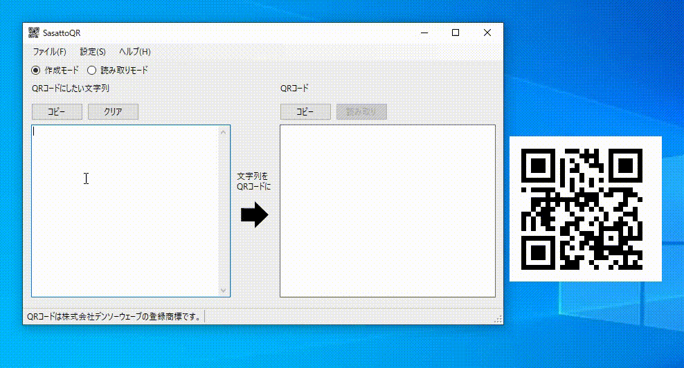

# SasattoQR

## 概要

QRコードの作成と読み取りを行うソフトウェアです。  
* 作成モード  
左の枠内の文字列をQRコードに変換します。  

* 読み取りモード  
読み取りモードにすると右の枠内が透過します。  
ソフトウェアを移動したり、サイズを変更したりして、右の枠内にQRコードが入るようにしてから読み取りボタンを押してください。 

## 動作確認環境
Microsoft Windows10 x64 + .NET Framework 4.8

## ライセンス等

This software is released under the MIT License.   
詳細については、[LICENSE](./LICENSE) ファイルを参照してください。

* [ZXing.Net](https://github.com/micjahn/ZXing.Net/)について  

  This software includes the work that is distributed in the Apache License 2.0.  
  ライセンスについてはZXing.Netフォルダ内の[COPYING](./ZXing.Net/COPYING)を確認願います。  

* QRコードについて  

  QRコードは株式会社デンソーウェーブの登録商標です。
